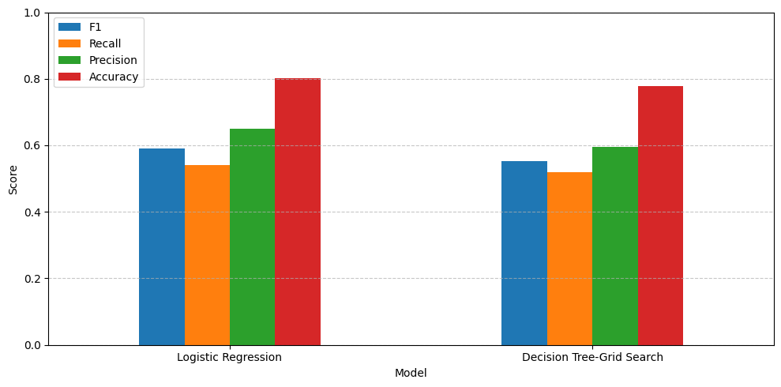

Title: Customer Churn Prediction

Overview: 
Customer churn, the act of customers discontinuing a service, is a major concern for telecom providers due to its direct impact on revenue and growth. Being able to identify potential churners before they leave enables businesses to implement proactive retention strategies.

In this project, I worked with the Telco Customer Churn dataset to develop predictive models that can forecast customer churn based on behavioral and demographic features. The goal was to uncover the underlying patterns and train machine learning models capable of accurately flagging customers at risk of leaving the platform.

The project includes the full data science pipeline from data cleaning and exploration to model training, evaluation, and comparison.

Dataset Description:
> Source: 'https://www.kaggle.com/datasets/blastchar/telco-customer-churn'
> Records: 7043 customer entries
> Attributes: 21 features including gender, senior citizen, tenure, internet service, total charges etc.
> Target Variable: Churn (Yes/No)

Problem Statement:
Predict whether the customer will churn or not based on attributes and usage behaviour.

Steps Performed:
1. Data Preprocessing:
   - Handled missing values and inconsistent formats
   - Converted categorical features using encoding techniques
   - Scaled numerical features for model compatibility
2. Exploratory Data Analysis (EDA):
   - Anaylzed Churn trends across tenure and number of customers
   - Identified skewness in Total Charges using histogram
3. Feature engineering:
   - Applied label encoding for binary features
   - One-hot encoding on multi-class features ('InternetService','Contract', 'PaymentMethod')
   - Standardize the training data
4. Model Training
   - Logistic Regression (baseline model)
   - Decision Tree Classifier (Hyperparameter Tuning with GridSearchCV)
5. Models Evaluation:
   - Evaluated both models on the basis of:
     1. Accuracy
     2. Precision
     3. Recall
     4. F1 Score
     5. ROC-AUC Score

     
     
     
7. Feature Importance Analysis:
   - Logistic Regression:
     Phone Service was found to be a key feature.
     

   - Decision Tree:
     Tenure was identified as the most influential predictor.
     
     
8. Model Comparison - selecting the best model
   - Logistic Regression showed better generalization with balanced     performance across all metrics.

   - Decision Tree, while slightly overfitting, provided better interpretability in terms of decision paths. 

Conclusion:
The Logistic Regression model outperformed the Decision Tree in terms of balanced evaluation metrics and interpretability. It serves as a reliable predictor of customer churn for this dataset, offering telecom companies a foundation for building effective retention strategies.

